# Helium

<!--suppress ALL -->
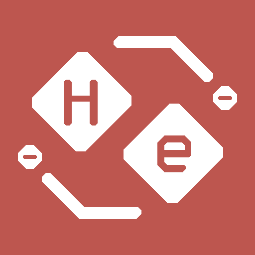

Мод для оптимизации интерфейса Mindustry, предоставляющий улучшенный и более понятный UI для лучшего игрового опыта.

### Основные функции

На данный момент мод находится на ранней стадии разработки. Основные возможности:

- **Размытие фона диалоговых окон (эффект матового стекла)**

  Мод "Гелий" добавляет более красивый размытый прозрачный фон для диалоговых окон (в настоящее время используется динамическое размытие, в будущем возможно добавление статического размытия при необходимости оптимизации)

  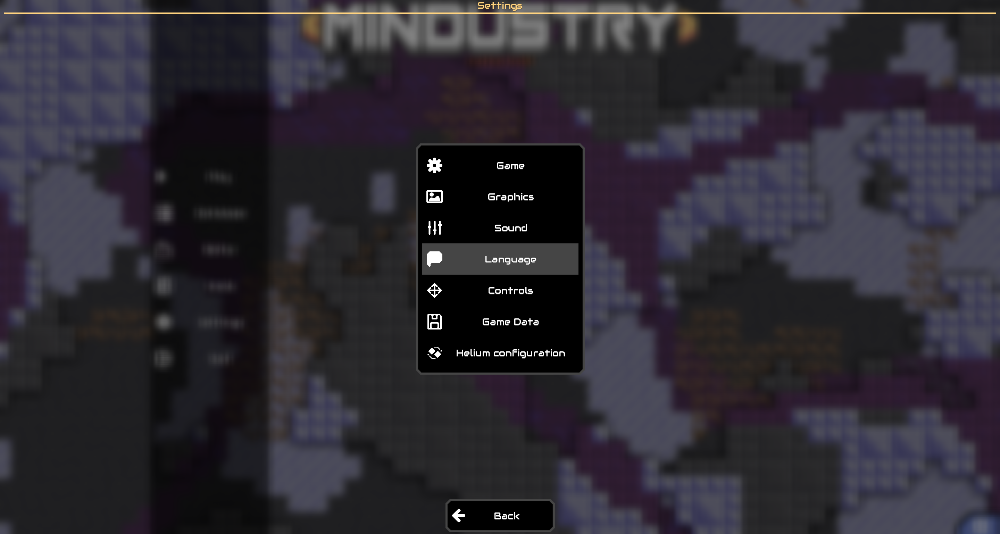
  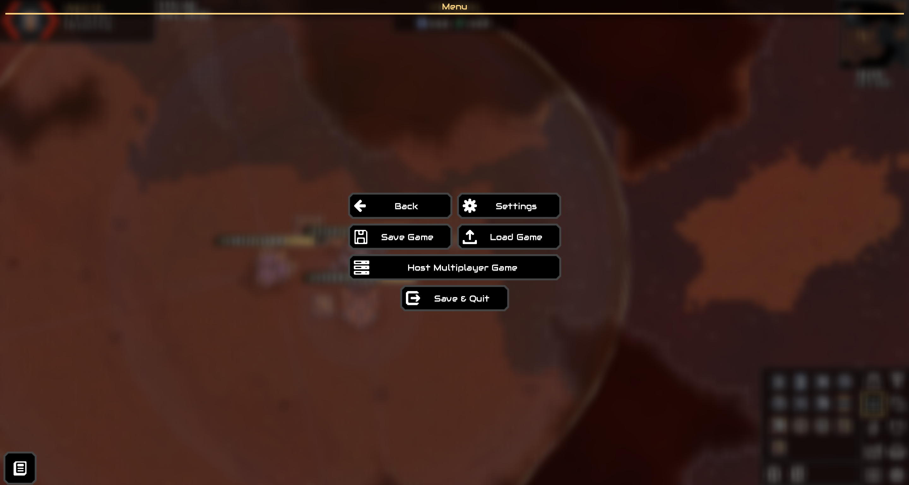

- **Компоненты отображения информации о сущностях в игре**

  Мод также добавляет различные элементы для отображения информации о сущностях: полосы здоровья, индикаторы статусов и указатели радиуса атаки

  - **Индикаторы здоровья и статусов**:
    
    Над юнитами и большинством сущностей отображается их текущее состояние, включая здоровье, щиты (при превышении максимального здоровья щиты отображаются слоями с индикатором уровня щитов)
    
    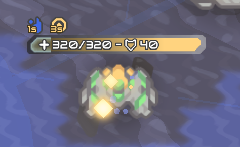
  
  - **Индикатор радиуса атаки**:
  
    Все юниты и турели теперь отображают свой радиус атаки в виде полупрозрачной области. Границы обрабатываются для выделения только внешних контуров перекрывающихся зон атаки одной команды, чтобы избежать визуального хаоса. Радиус атаки каждого юнита/турели имеет малозаметную анимацию пульсации и цветовые градиенты
  
    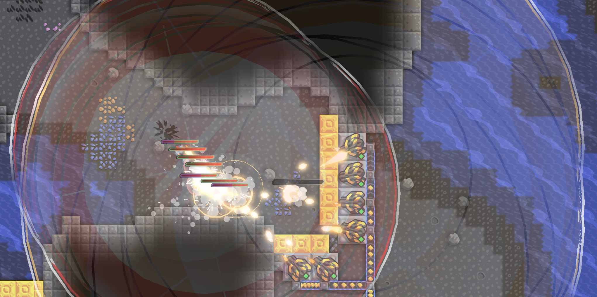
  
  - **Индикаторы радиуса эффектов функциональных блоков**:
  
    Радиус действия таких устройств, как ремонтные проекторы, ускорители и ремонтные станции юнитов, отображается аналогично радиусу атаки, с определенными цветами для каждого типа
  
    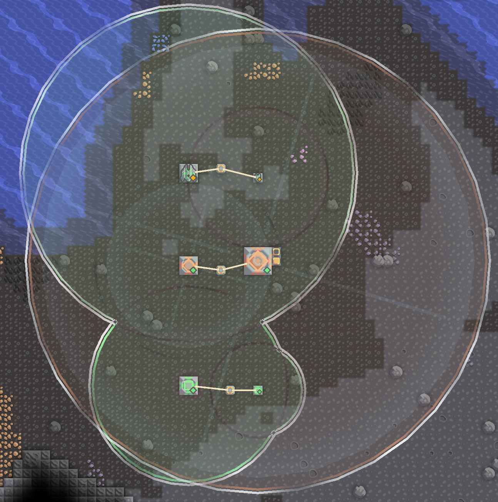

  Удерживайте горячую клавишу (по умолчанию левый Alt на клавиатуре или кнопка на панели инструментов на Android) для отображения детальной информации, такой как угол атаки оружия юнита, подробные характеристики (поскольку панель оптимизации отключает всплывающие подсказки на панели размещения блоков, можно удерживать горячую клавишу для выбора цели и отображения подробностей):

  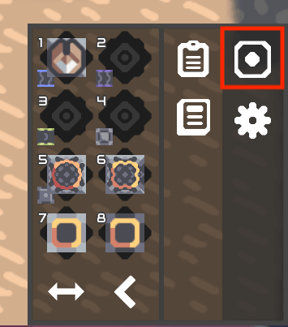

  Все функции можно настроить через панель быстрой конфигурации для отображения для определенных команд. Отключенные команды не будут показывать соответствующие функции. Инструмент быстрой настройки открывается через кнопку на панели инструментов:

  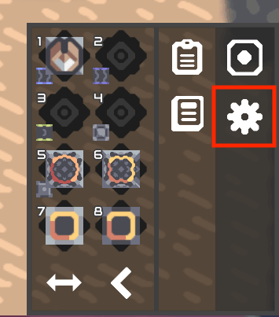

  Панель конфигурации:

  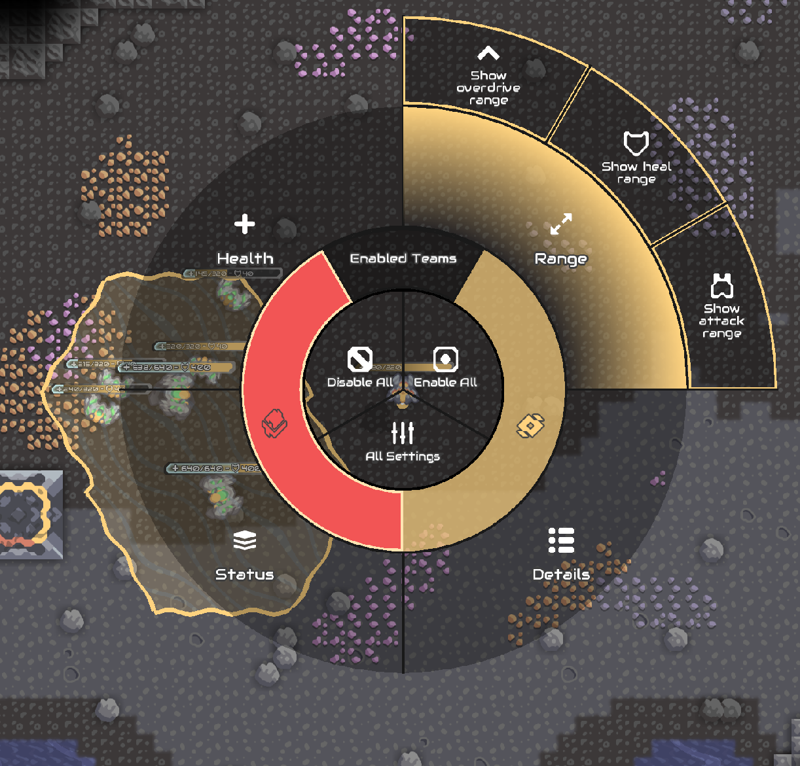
  
- **Улучшенная панель размещения блоков**

  Улучшенная панель выбора блоков, объединяющая быструю панель предметов и стандартизированную таблицу кнопок инструментов. В обычном состоянии может быть свернута для отображения только быстрой панели предметов и панели инструментов, чтобы уменьшить количество информации на HUD.

  Быстрая панель предметов поддерживает перелистывание страниц и позволяет выбирать часто используемые предметы для быстрого доступа к нужным блокам в свернутом состоянии.

  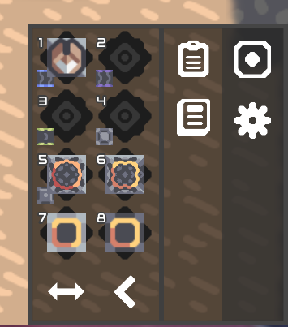
  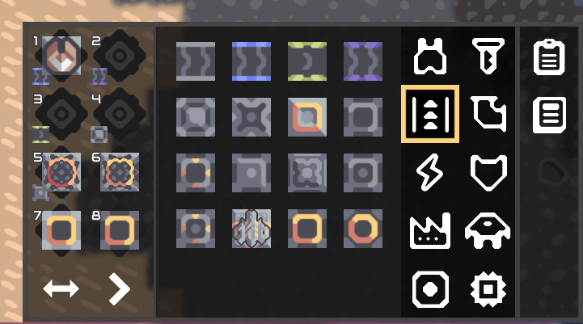

- **Улучшенный менеджер модов и браузер**

  Переработанный менеджер модов и браузер игры - теперь он выглядит красивее и функциональнее. При включении мода откройте страницу [Моды], чтобы перейти в новый интерфейс управления:
  
  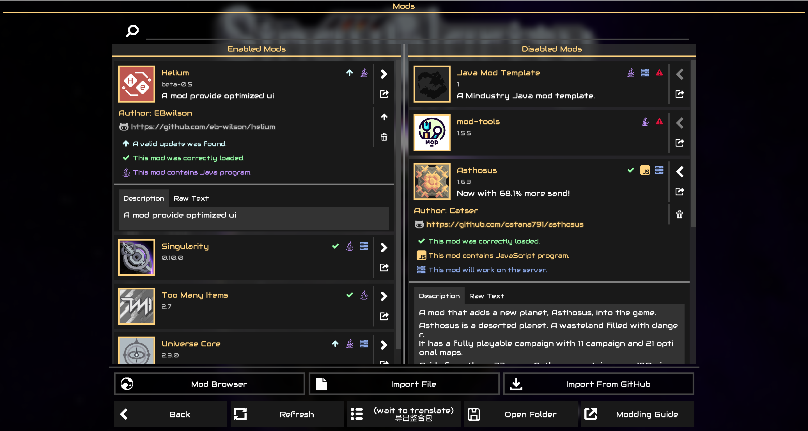
  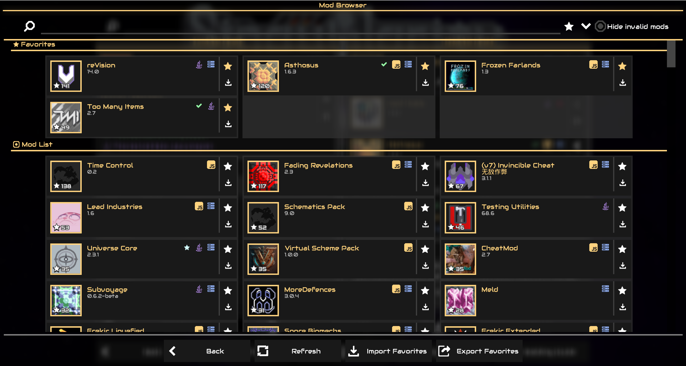

### Настройки мода

В игровом меню настроек добавлена опция **_[Конфигурация Гелия]_**, позволяющая перейти к настройкам мода. Все изменения и оптимизации интерфейса модульны и могут быть легко настроены здесь.

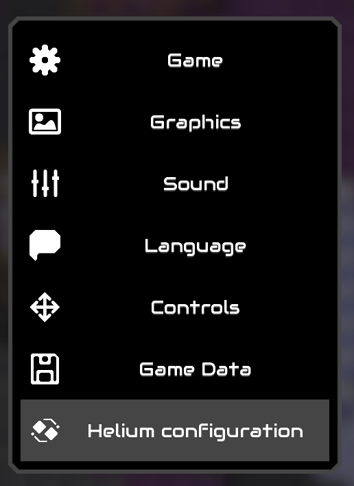
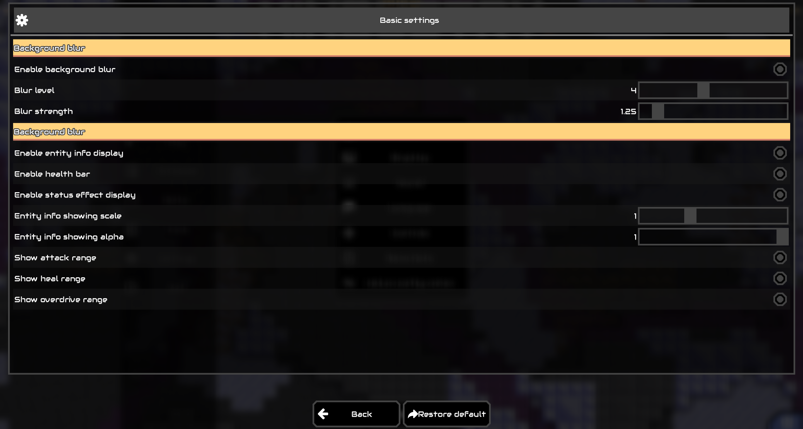

### План разработки

Текущие основные задачи:

- [x] Быстрое переключение панелей информации в игре
- [ ] Улучшенный внутриигровой HUD (информация о волнах в левом верхнем углу, панель выбора блоков в правом нижнем углу)
- [x] (частично завершено) Улучшенная быстрая панель предметов и интеллектуальная рекомендуемая панель, заменяющая стандартную панель выбора блоков
- [x] Стандартизированная панель быстрого доступа для лучшего размещения кнопок управления в интерфейсе
- [x] Переработанный интерфейс настроек модов

Планы на будущее:

- [ ] Статическое размытие фона
- [ ] Переработка игрового меню настроек
- [ ] Быстрые чертежи
- [ ] Индикаторы радиуса атаки/эффектов с пониженным качеством для повышения производительности
